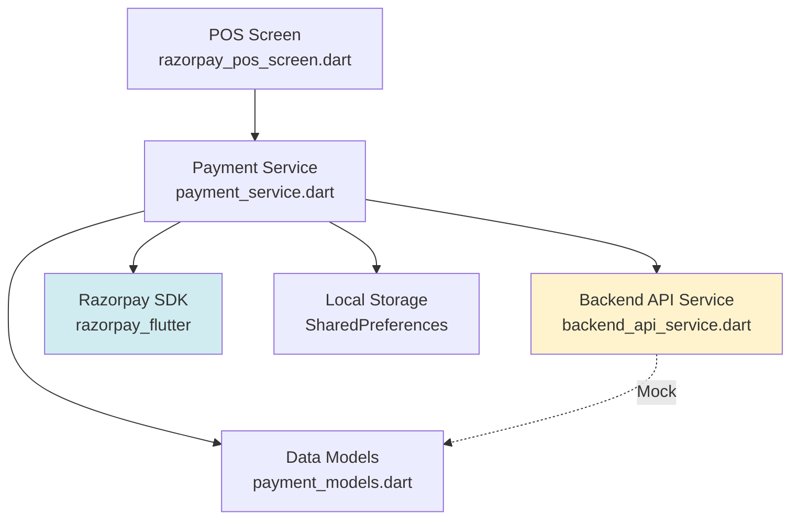
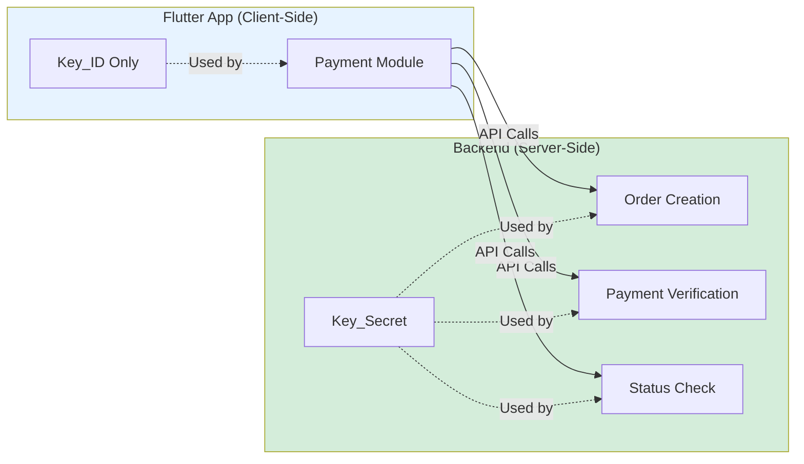
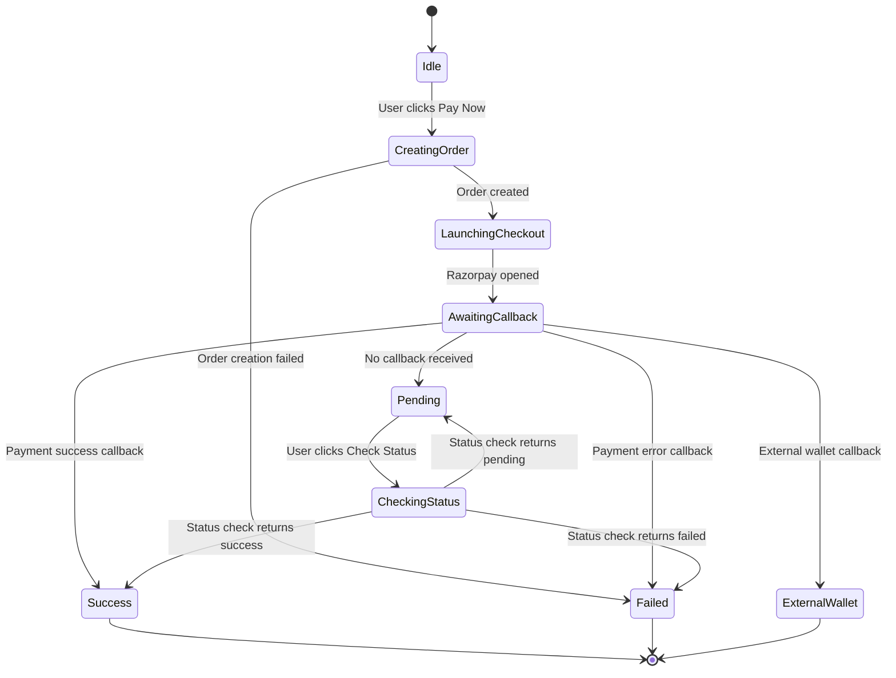

# Design Document: Nourisha POS Payment Module

## Overview

The Nourisha POS Payment Module is a secure, production-ready Flutter component that integrates Razorpay payment processing for Point-of-Sale environments. The design prioritizes security by enforcing strict separation between client-side and server-side operations, ensuring that sensitive credentials never exist in the Flutter application.

The module follows a clean architecture pattern with three primary layers:
1. **UI Layer**: POS-optimized screen with clear visual feedback
2. **Service Layer**: Payment orchestration and Razorpay SDK management
3. **Data Layer**: Models and mock backend integration

Key design principles:
- Security-first: No Key_Secret in client code, all sensitive operations via backend
- Resilience: Handle payment interruptions, app crashes, and network failures
- Reconciliation: Manual payment status verification when callbacks fail
- Reusability: Drop-in module for any Nourisha or third-party Flutter app
- POS-optimized: Large touch targets, clear status colors, minimal UI

## Architecture

### High-Level Component Diagram



### Security Boundary




## Components and Interfaces

### 1. Payment Models (payment_models.dart)

Data structures for payment operations:

```dart
// Order creation response from backend
class OrderResponse {
  final String orderId;
  final int amount;        // Amount in smallest currency unit (paise)
  final String currency;   // e.g., "INR"
  final String? reference; // Optional order reference
  
  OrderResponse({
    required this.orderId,
    required this.amount,
    required this.currency,
    this.reference,
  });
  
  factory OrderResponse.fromJson(Map<String, dynamic> json);
  Map<String, dynamic> toJson();
}

// Payment result from Razorpay callback
class PaymentResult {
  final PaymentStatus status;
  final String? paymentId;
  final String? orderId;
  final String? signature;
  final String? errorCode;
  final String? errorDescription;
  final String? walletName;
  final DateTime timestamp;
  
  PaymentResult({
    required this.status,
    this.paymentId,
    this.orderId,
    this.signature,
    this.errorCode,
    this.errorDescription,
    this.walletName,
    required this.timestamp,
  });
  
  factory PaymentResult.success({
    required String paymentId,
    required String orderId,
    required String signature,
  });
  
  factory PaymentResult.failure({
    required String orderId,
    required String errorCode,
    required String errorDescription,
  });
  
  factory PaymentResult.externalWallet({
    required String walletName,
  });
  
  Map<String, dynamic> toJson();
}

// Payment status enumeration
enum PaymentStatus {
  pending,
  success,
  failed,
  unknown,
}

// Payment status check response from backend
class PaymentStatusResponse {
  final String orderId;
  final String? paymentId;
  final PaymentStatus status;
  final int amount;
  final String currency;
  final DateTime? paidAt;
  final Map<String, dynamic>? metadata;
  
  PaymentStatusResponse({
    required this.orderId,
    this.paymentId,
    required this.status,
    required this.amount,
    required this.currency,
    this.paidAt,
    this.metadata,
  });
  
  factory PaymentStatusResponse.fromJson(Map<String, dynamic> json);
  Map<String, dynamic> toJson();
}
```

### 2. Backend API Service (backend_api_service.dart)

Mock backend integration with clear contracts:

```dart
// SECURITY NOTE: This service represents backend API calls.
// In production, these endpoints MUST be implemented on a secure server
// that holds the Razorpay Key_Secret. The Flutter app NEVER has Key_Secret.

class BackendApiService {
  final String baseUrl;
  
  BackendApiService({required this.baseUrl});
  
  // TODO: Replace with actual HTTP client implementation
  // POST /api/payments/create-order
  Future<OrderResponse> createOrder({
    required int amount,
    String? reference,
  }) async {
    // MOCK IMPLEMENTATION
    // Production: Call backend API with amount and reference
    // Backend creates Razorpay order using Key_Secret
    // Backend returns order_id to client
    
    await Future.delayed(Duration(milliseconds: 500)); // Simulate network
    
    return OrderResponse(
      orderId: 'order_mock_${DateTime.now().millisecondsSinceEpoch}',
      amount: amount,
      currency: 'INR',
      reference: reference,
    );
  }
  
  // TODO: Replace with actual HTTP client implementation
  // POST /api/payments/verify
  Future<bool> verifyPayment({
    required String orderId,
    required String paymentId,
    required String signature,
  }) async {
    // MOCK IMPLEMENTATION
    // Production: Call backend API with payment details
    // Backend verifies signature using Key_Secret
    // Backend returns verification result
    
    await Future.delayed(Duration(milliseconds: 300));
    
    // Mock: Always return true for demo
    return true;
  }
  
  // TODO: Replace with actual HTTP client implementation
  // GET /api/payments/status/{orderId}
  Future<PaymentStatusResponse> checkPaymentStatus({
    String? orderId,
    String? paymentId,
  }) async {
    // MOCK IMPLEMENTATION
    // Production: Call backend API with orderId or paymentId
    // Backend queries Razorpay API using Key_Secret
    // Backend returns current payment status
    
    await Future.delayed(Duration(milliseconds: 400));
    
    return PaymentStatusResponse(
      orderId: orderId ?? 'order_unknown',
      paymentId: paymentId,
      status: PaymentStatus.pending,
      amount: 0,
      currency: 'INR',
    );
  }
}
```

### 3. Payment Service (payment_service.dart)

Core payment orchestration logic:

```dart
class PaymentService {
  late Razorpay _razorpay;
  final BackendApiService _backendApi;
  final SharedPreferences _prefs;
  
  // SECURITY: Only Key_ID is stored in client
  // Key_Secret MUST NEVER be in this code
  static const String RAZORPAY_KEY_ID = 'rzp_test_PLACEHOLDER'; // TODO: Replace with actual test key
  
  // Storage keys for persistence
  static const String _lastOrderIdKey = 'last_order_id';
  static const String _lastPaymentIdKey = 'last_payment_id';
  static const String _lastPaymentStatusKey = 'last_payment_status';
  
  PaymentResult? _lastResult;
  
  PaymentService({
    required BackendApiService backendApi,
    required SharedPreferences prefs,
  })  : _backendApi = backendApi,
        _prefs = prefs {
    _initializeRazorpay();
  }
  
  void _initializeRazorpay() {
    _razorpay = Razorpay();
    _razorpay.on(Razorpay.EVENT_PAYMENT_SUCCESS, _handlePaymentSuccess);
    _razorpay.on(Razorpay.EVENT_PAYMENT_ERROR, _handlePaymentError);
    _razorpay.on(Razorpay.EVENT_EXTERNAL_WALLET, _handleExternalWallet);
  }
  
  // Launch Razorpay checkout
  Future<void> openCheckout({
    required int amount,
    String? reference,
  }) async {
    try {
      // Step 1: Create order via backend (backend uses Key_Secret)
      final orderResponse = await _backendApi.createOrder(
        amount: amount,
        reference: reference,
      );
      
      // Step 2: Persist order_id for recovery
      await _saveOrderId(orderResponse.orderId);
      
      // Step 3: Launch Razorpay checkout with Key_ID only
      var options = {
        'key': RAZORPAY_KEY_ID,
        'amount': orderResponse.amount,
        'currency': orderResponse.currency,
        'name': 'Nourisha POS',
        'description': reference ?? 'Payment',
        'order_id': orderResponse.orderId,
        'prefill': {
          'contact': '',
          'email': '',
        },
        'theme': {
          'color': '#2196F3',
        },
      };
      
      _razorpay.open(options);
    } catch (e) {
      // Handle order creation failure
      _lastResult = PaymentResult(
        status: PaymentStatus.failed,
        errorCode: 'ORDER_CREATION_FAILED',
        errorDescription: e.toString(),
        timestamp: DateTime.now(),
      );
      rethrow;
    }
  }
  
  void _handlePaymentSuccess(PaymentSuccessResponse response) async {
    _lastResult = PaymentResult.success(
      paymentId: response.paymentId ?? '',
      orderId: response.orderId ?? '',
      signature: response.signature ?? '',
    );
    
    await _savePaymentId(response.paymentId ?? '');
    await _savePaymentStatus(PaymentStatus.success);
    
    // TODO: Optionally verify payment with backend here
    // await _backendApi.verifyPayment(...)
  }
  
  void _handlePaymentError(PaymentFailureResponse response) async {
    _lastResult = PaymentResult.failure(
      orderId: await _getLastOrderId() ?? 'unknown',
      errorCode: response.code.toString(),
      errorDescription: response.message ?? 'Payment failed',
    );
    
    await _savePaymentStatus(PaymentStatus.failed);
  }
  
  void _handleExternalWallet(ExternalWalletResponse response) async {
    _lastResult = PaymentResult.externalWallet(
      walletName: response.walletName ?? 'Unknown',
    );
  }
  
  // Check payment status via backend
  Future<PaymentStatusResponse> checkStatus() async {
    final orderId = await _getLastOrderId();
    final paymentId = await _getLastPaymentId();
    
    return await _backendApi.checkPaymentStatus(
      orderId: orderId,
      paymentId: paymentId,
    );
  }
  
  // Persistence methods
  Future<void> _saveOrderId(String orderId) async {
    await _prefs.setString(_lastOrderIdKey, orderId);
  }
  
  Future<String?> _getLastOrderId() async {
    return _prefs.getString(_lastOrderIdKey);
  }
  
  Future<void> _savePaymentId(String paymentId) async {
    await _prefs.setString(_lastPaymentIdKey, paymentId);
  }
  
  Future<String?> _getLastPaymentId() async {
    return _prefs.getString(_lastPaymentIdKey);
  }
  
  Future<void> _savePaymentStatus(PaymentStatus status) async {
    await _prefs.setString(_lastPaymentStatusKey, status.toString());
  }
  
  PaymentResult? get lastResult => _lastResult;
  
  void dispose() {
    _razorpay.clear();
  }
}
```

### 4. POS Screen UI (razorpay_pos_screen.dart)

POS-optimized user interface:

```dart
class RazorpayPosScreen extends StatefulWidget {
  const RazorpayPosScreen({super.key});
  
  @override
  State<RazorpayPosScreen> createState() => _RazorpayPosScreenState();
}

class _RazorpayPosScreenState extends State<RazorpayPosScreen> {
  final _amountController = TextEditingController();
  final _referenceController = TextEditingController();
  late PaymentService _paymentService;
  
  String _responseText = '';
  PaymentStatus _currentStatus = PaymentStatus.unknown;
  bool _isProcessing = false;
  
  @override
  void initState() {
    super.initState();
    _initializePaymentService();
  }
  
  Future<void> _initializePaymentService() async {
    final prefs = await SharedPreferences.getInstance();
    final backendApi = BackendApiService(baseUrl: 'https://api.nourisha.com'); // TODO: Configure
    
    _paymentService = PaymentService(
      backendApi: backendApi,
      prefs: prefs,
    );
  }
  
  Future<void> _handlePayNow() async {
    final amountText = _amountController.text.trim();
    if (amountText.isEmpty) {
      _showError('Please enter amount');
      return;
    }
    
    final amount = int.tryParse(amountText);
    if (amount == null || amount <= 0) {
      _showError('Please enter valid amount');
      return;
    }
    
    setState(() {
      _isProcessing = true;
      _responseText = 'Initiating payment...';
    });
    
    try {
      // Amount in paise (multiply by 100)
      await _paymentService.openCheckout(
        amount: amount * 100,
        reference: _referenceController.text.trim(),
      );
      
      // Wait for callback
      await Future.delayed(Duration(seconds: 2));
      
      final result = _paymentService.lastResult;
      if (result != null) {
        _displayResult(result);
      }
    } catch (e) {
      setState(() {
        _responseText = 'Error: $e';
        _currentStatus = PaymentStatus.failed;
      });
    } finally {
      setState(() {
        _isProcessing = false;
      });
    }
  }
  
  Future<void> _handleCheckStatus() async {
    setState(() {
      _isProcessing = true;
      _responseText = 'Checking payment status...';
    });
    
    try {
      final statusResponse = await _paymentService.checkStatus();
      _displayStatusResponse(statusResponse);
    } catch (e) {
      setState(() {
        _responseText = 'Error checking status: $e';
      });
    } finally {
      setState(() {
        _isProcessing = false;
      });
    }
  }
  
  void _displayResult(PaymentResult result) {
    setState(() {
      _currentStatus = result.status;
      _responseText = _formatJson(result.toJson());
    });
  }
  
  void _displayStatusResponse(PaymentStatusResponse response) {
    setState(() {
      _currentStatus = response.status;
      _responseText = _formatJson(response.toJson());
    });
  }
  
  String _formatJson(Map<String, dynamic> json) {
    // Pretty print JSON with indentation
    const encoder = JsonEncoder.withIndent('  ');
    return encoder.convert(json);
  }
  
  Color _getStatusColor() {
    switch (_currentStatus) {
      case PaymentStatus.success:
        return Colors.green;
      case PaymentStatus.failed:
        return Colors.red;
      case PaymentStatus.pending:
        return Colors.orange;
      default:
        return Colors.grey;
    }
  }
  
  void _showError(String message) {
    ScaffoldMessenger.of(context).showSnackBar(
      SnackBar(content: Text(message)),
    );
  }
  
  @override
  Widget build(BuildContext context) {
    return Scaffold(
      appBar: AppBar(
        title: const Text('Nourisha POS – Payment'),
        backgroundColor: Theme.of(context).colorScheme.primary,
      ),
      body: Padding(
        padding: const EdgeInsets.all(24.0),
        child: Column(
          crossAxisAlignment: CrossAxisAlignment.stretch,
          children: [
            // Amount input
            TextField(
              controller: _amountController,
              decoration: const InputDecoration(
                labelText: 'Amount (₹)',
                border: OutlineInputBorder(),
                prefixText: '₹ ',
              ),
              keyboardType: TextInputType.number,
              style: const TextStyle(fontSize: 32, fontWeight: FontWeight.bold),
            ),
            const SizedBox(height: 16),
            
            // Reference input
            TextField(
              controller: _referenceController,
              decoration: const InputDecoration(
                labelText: 'Order Reference (Optional)',
                border: OutlineInputBorder(),
              ),
              style: const TextStyle(fontSize: 18),
            ),
            const SizedBox(height: 24),
            
            // Pay Now button
            ElevatedButton(
              onPressed: _isProcessing ? null : _handlePayNow,
              style: ElevatedButton.styleFrom(
                padding: const EdgeInsets.symmetric(vertical: 20),
                textStyle: const TextStyle(fontSize: 24),
              ),
              child: _isProcessing
                  ? const CircularProgressIndicator()
                  : const Text('Pay Now'),
            ),
            const SizedBox(height: 16),
            
            // Check Status button
            OutlinedButton(
              onPressed: _isProcessing ? null : _handleCheckStatus,
              style: OutlinedButton.styleFrom(
                padding: const EdgeInsets.symmetric(vertical: 16),
                textStyle: const TextStyle(fontSize: 18),
              ),
              child: const Text('Check Payment Status'),
            ),
            const SizedBox(height: 24),
            
            // Response panel
            Expanded(
              child: Container(
                decoration: BoxDecoration(
                  border: Border.all(color: _getStatusColor(), width: 2),
                  borderRadius: BorderRadius.circular(8),
                  color: Colors.grey[100],
                ),
                padding: const EdgeInsets.all(16),
                child: SingleChildScrollView(
                  child: Text(
                    _responseText.isEmpty ? 'Response will appear here' : _responseText,
                    style: const TextStyle(
                      fontFamily: 'monospace',
                      fontSize: 14,
                    ),
                  ),
                ),
              ),
            ),
          ],
        ),
      ),
    );
  }
  
  @override
  void dispose() {
    _amountController.dispose();
    _referenceController.dispose();
    _paymentService.dispose();
    super.dispose();
  }
}
```


## Data Models

### Payment Flow State Machine



### Data Persistence Strategy

The module uses SharedPreferences for lightweight state persistence:

- **last_order_id**: Most recent order ID for recovery after app restart
- **last_payment_id**: Most recent payment ID for status verification
- **last_payment_status**: Last known payment status (success/failed/pending)

This ensures that if the app crashes or is closed during payment, the cashier can:
1. Reopen the app
2. Click "Check Payment Status"
3. Retrieve the actual payment status from the backend

### Error Handling Categories

1. **Order Creation Errors**: Backend API unavailable, network timeout
2. **Razorpay SDK Errors**: Invalid configuration, user cancellation
3. **Callback Timeout**: Payment completed but callback not received
4. **Verification Errors**: Signature mismatch, invalid payment ID
5. **Status Check Errors**: Backend unavailable during reconciliation

Each error category has specific handling:
- Display clear error message in response panel
- Preserve order_id for manual reconciliation
- Provide "Check Payment Status" option
- Log error details for debugging


## Correctness Properties

A property is a characteristic or behavior that should hold true across all valid executions of a system—essentially, a formal statement about what the system should do. Properties serve as the bridge between human-readable specifications and machine-verifiable correctness guarantees.

### Property Reflection

After analyzing all acceptance criteria, I've identified the following consolidations to eliminate redundancy:

- **Backend API Call Properties (1.3, 1.4, 1.5)**: These can be consolidated into a single property about backend delegation
- **State Persistence Properties (4.3, 4.4, 4.5)**: These can be consolidated into a single property about state persistence
- **Callback Handling Properties (3.6, 3.7, 3.8)**: These are distinct and should remain separate
- **Status Color Properties (4.6, 4.7, 4.8)**: These are examples, not properties, and test specific mappings
- **API Response Structure Properties (8.2, 8.4, 8.6)**: These can be consolidated into a single property about response completeness

### Core Properties

**Property 1: Backend API Delegation for Secure Operations**

*For any* payment operation requiring Razorpay Key_Secret (order creation, payment verification, status check), the Payment_Module should delegate to Backend_API endpoints rather than performing the operation client-side.

**Validates: Requirements 1.3, 1.4, 1.5**

---

**Property 2: Payment Flow Triggers Backend Order Creation**

*For any* amount and optional reference, when the Pay Now button is pressed, the Payment_Service should call the Backend_API createOrder endpoint with the provided parameters.

**Validates: Requirements 3.1**

---

**Property 3: Order Response Extraction**

*For any* valid order response from Backend_API, the Payment_Service should correctly extract the Order_ID field.

**Validates: Requirements 3.2**

---

**Property 4: Razorpay Checkout Launch with Correct Parameters**

*For any* Order_ID received from backend, the Payment_Service should launch Razorpay_Checkout with the Order_ID, amount, currency, and Key_ID (not Key_Secret).

**Validates: Requirements 3.3**

---

**Property 5: Success Callback Captures Payment Details**

*For any* payment success callback from Razorpay, the Payment_Service should capture the Payment_ID and signature fields.

**Validates: Requirements 3.6**

---

**Property 6: Error Callback Captures Error Details**

*For any* payment error callback from Razorpay, the Payment_Service should capture the error code and error description fields.

**Validates: Requirements 3.7**

---

**Property 7: External Wallet Callback Captures Wallet Name**

*For any* external wallet callback from Razorpay, the Payment_Service should capture the wallet name field.

**Validates: Requirements 3.8**

---

**Property 8: Payment Response JSON Formatting**

*For any* payment response (success, error, or status), the POS_Screen should format the response as valid, parseable JSON.

**Validates: Requirements 4.2**

---

**Property 9: Payment State Persistence**

*For any* payment operation, the Payment_Module should persist the Order_ID, Payment_ID (if available), and Payment_Status to local storage.

**Validates: Requirements 4.3, 4.4, 4.5**

---

**Property 10: Order ID Persistence and Restoration (Round Trip)**

*For any* Order_ID, if the app persists it to local storage and then restarts, restoring from local storage should return the same Order_ID.

**Validates: Requirements 5.2, 5.3**

---

**Property 11: Backend Error Display**

*For any* Backend_API call that fails with an error response, the Payment_Module should display the error details in the response panel.

**Validates: Requirements 5.5**

---

**Property 12: Status Check Triggers Backend API Call**

*For any* stored Order_ID or Payment_ID, when the Check Payment Status button is pressed, the Payment_Service should call the Backend_API checkPaymentStatus endpoint with the stored identifier.

**Validates: Requirements 6.2**

---

**Property 13: Payment Status Parsing**

*For any* payment status response from Backend_API, the Payment_Service should parse it into one of the valid PaymentStatus enum values (success, failed, pending, unknown).

**Validates: Requirements 6.3**

---

**Property 14: Status Retrieval Updates UI**

*For any* payment status retrieved from Backend_API, the POS_Screen should update the response panel with the new status information.

**Validates: Requirements 6.4**

---

**Property 15: Touch Target Minimum Size**

*For all* interactive UI elements (buttons, input fields), the touch target size should meet or exceed 48x48 dp (Material Design minimum).

**Validates: Requirements 2.7**

---

**Property 16: API Response Completeness**

*For any* Backend_API response (createOrder, verifyPayment, checkPaymentStatus), the response should contain all required fields as defined in the API contract.

**Validates: Requirements 8.2, 8.4, 8.6**

---

**Property 17: Mock Backend Response Structure Validity**

*For any* mock Backend_API endpoint call, the returned response should have the same structure and field types as the production API contract.

**Validates: Requirements 8.7**

---

**Property 18: API Contract Parameter Acceptance**

*For any* valid input parameters, the Backend_API service methods (createOrder, verifyPayment, checkPaymentStatus) should accept and process them without throwing parameter validation errors.

**Validates: Requirements 8.1, 8.3, 8.5**


## Error Handling

### Error Categories and Handling Strategy

#### 1. Order Creation Errors

**Scenarios:**
- Backend API unavailable (network timeout, server down)
- Invalid amount (negative, zero, exceeds limits)
- Backend returns error response (validation failure)

**Handling:**
- Catch exception in `openCheckout()` method
- Create PaymentResult with status `failed` and error details
- Display error in response panel with red border
- Do not launch Razorpay checkout
- Preserve any partial state for debugging

**User Action:**
- Retry payment after checking network/amount
- Contact support if backend consistently fails

---

#### 2. Razorpay SDK Errors

**Scenarios:**
- Invalid Key_ID configuration
- User cancels payment in Razorpay UI
- Razorpay SDK initialization failure
- Payment method unavailable

**Handling:**
- `onPaymentError` callback captures error code and description
- Map Razorpay error codes to user-friendly messages
- Display error in response panel
- Preserve Order_ID for potential retry or status check

**User Action:**
- Retry payment if user cancelled
- Check payment status if uncertain
- Verify Razorpay configuration if initialization fails

---

#### 3. Callback Timeout / Lost Callback

**Scenarios:**
- Payment completed but callback not received (app killed, network issue)
- App closed during Razorpay payment flow
- Callback delayed beyond reasonable timeout

**Handling:**
- Order_ID persisted to SharedPreferences before launching Razorpay
- On app restart, last Order_ID is available
- Display message: "Payment status uncertain. Click 'Check Payment Status' to verify."
- "Check Payment Status" button queries backend for actual status

**User Action:**
- Click "Check Payment Status" to reconcile
- Backend queries Razorpay API and returns actual status
- Update UI with confirmed status

---

#### 4. Payment Verification Errors

**Scenarios:**
- Signature mismatch (potential tampering)
- Invalid Payment_ID
- Backend verification service unavailable

**Handling:**
- Log verification failure details
- Display warning in response panel
- Mark payment as "pending verification"
- Recommend manual status check

**User Action:**
- Use "Check Payment Status" for backend verification
- Contact support if verification consistently fails

---

#### 5. Status Check Errors

**Scenarios:**
- Backend API unavailable during reconciliation
- Invalid Order_ID or Payment_ID
- Network timeout during status check

**Handling:**
- Catch exception in `checkStatus()` method
- Display error message: "Unable to check status. Please try again."
- Preserve last known state
- Allow retry

**User Action:**
- Retry status check after network recovery
- Verify Order_ID/Payment_ID if invalid
- Contact support for manual reconciliation

---

### Error Message Guidelines

All error messages should:
- Be clear and actionable
- Avoid technical jargon for cashier users
- Include next steps (retry, check status, contact support)
- Display full technical details in response panel for debugging
- Use appropriate color coding (red for errors, orange for warnings)

### Logging Strategy

For production deployment:
- Log all Backend_API calls with timestamps
- Log all Razorpay callbacks with full payload
- Log all errors with stack traces
- Log payment state transitions
- Use structured logging for easy parsing
- Ensure logs don't contain sensitive data (Key_Secret, card details)


## Testing Strategy

### Dual Testing Approach

The Nourisha POS Payment Module requires both unit tests and property-based tests for comprehensive coverage:

- **Unit tests**: Verify specific examples, edge cases, UI components, and integration points
- **Property tests**: Verify universal properties across randomized inputs

Both testing approaches are complementary and necessary. Unit tests catch concrete bugs in specific scenarios, while property tests verify general correctness across a wide range of inputs.

### Property-Based Testing Configuration

**Library Selection:**
- Use `fake_async` for Flutter async testing
- Use custom property test harness with randomized input generation
- Minimum 100 iterations per property test (due to randomization)

**Test Tagging:**
Each property test must include a comment referencing the design document property:
```dart
// Feature: nourisha-pos-payment-module, Property 1: Backend API Delegation for Secure Operations
test('property: backend delegation for secure operations', () async {
  // Test implementation
});
```

**Property Test Structure:**
1. Generate random valid inputs (amounts, references, order IDs)
2. Execute the operation
3. Assert the property holds
4. Repeat for minimum 100 iterations

### Unit Testing Strategy

#### Test Coverage Areas

**1. Payment Models Tests** (`test/payment_models_test.dart`)
- OrderResponse serialization/deserialization
- PaymentResult factory constructors
- PaymentStatus enum values
- PaymentStatusResponse parsing
- JSON formatting correctness
- Edge cases: null values, empty strings, invalid JSON

**2. Backend API Service Tests** (`test/backend_api_service_test.dart`)
- Mock createOrder returns valid OrderResponse
- Mock verifyPayment returns boolean
- Mock checkPaymentStatus returns valid PaymentStatusResponse
- Error handling for network failures
- Response structure validation
- Timeout handling

**3. Payment Service Tests** (`test/payment_service_test.dart`)
- Razorpay SDK initialization
- openCheckout() flow with mocked backend
- Callback handlers (success, error, external wallet)
- Order_ID persistence to SharedPreferences
- Payment_ID persistence after success
- Status persistence after callbacks
- checkStatus() calls backend with correct parameters
- Dispose cleans up Razorpay instance

**4. POS Screen Widget Tests** (`test/razorpay_pos_screen_test.dart`)
- Screen renders with correct title
- Amount input field exists and accepts numeric input
- Reference input field exists
- Pay Now button exists and is tappable
- Check Payment Status button exists
- Response panel displays formatted JSON
- Status color changes based on PaymentStatus
- Touch targets meet minimum size (48x48 dp)
- Error messages display in SnackBar

**5. Integration Tests** (`test/integration_test.dart`)
- End-to-end payment flow with mocked Razorpay
- App restart recovery scenario
- Status check after lost callback
- Multiple payment attempts
- Error recovery flows

#### Edge Cases to Test

1. **Empty/Invalid Amount**: Zero, negative, non-numeric input
2. **Empty Order Response**: Backend returns empty or malformed JSON
3. **Null Callback Fields**: Razorpay callback missing expected fields
4. **App Restart During Payment**: Persist and restore Order_ID
5. **Concurrent Status Checks**: Multiple rapid status check button presses
6. **SharedPreferences Failure**: Handle storage write/read failures
7. **Very Large Amounts**: Test with maximum integer values
8. **Special Characters in Reference**: Unicode, emojis, SQL injection attempts

### Property-Based Testing Strategy

#### Property Test Implementation

**Property 1: Backend API Delegation**
```dart
// Feature: nourisha-pos-payment-module, Property 1: Backend API Delegation for Secure Operations
test('property: all secure operations delegate to backend', () async {
  for (int i = 0; i < 100; i++) {
    final mockBackend = MockBackendApiService();
    final service = PaymentService(backendApi: mockBackend, prefs: mockPrefs);
    
    // Generate random amount
    final amount = Random().nextInt(100000) + 100;
    
    await service.openCheckout(amount: amount);
    
    // Verify backend was called, not direct Razorpay order creation
    verify(mockBackend.createOrder(amount: amount)).called(1);
  }
});
```

**Property 2-18**: Similar structure with randomized inputs testing each property

#### Test Data Generation

**Random Amount Generator:**
- Range: 100 to 1,000,000 paise (₹1 to ₹10,000)
- Include edge cases: 1, 100, 999999999

**Random Reference Generator:**
- Alphanumeric strings
- Length: 0 to 100 characters
- Include special characters, Unicode

**Random Order_ID Generator:**
- Format: `order_<timestamp>_<random>`
- Valid Razorpay order ID patterns

**Random Payment_ID Generator:**
- Format: `pay_<random>`
- Valid Razorpay payment ID patterns

### Test Execution

**Local Development:**
```bash
flutter test                    # Run all tests
flutter test --coverage         # Run with coverage report
flutter test test/payment_service_test.dart  # Run specific test file
```

**CI/CD Pipeline:**
- Run all tests on every commit
- Require 80% code coverage minimum
- Run property tests with 100 iterations
- Fail build on any test failure
- Generate and archive coverage reports

### Mocking Strategy

**Mock Razorpay SDK:**
- Use `mockito` to mock Razorpay class
- Simulate callbacks by directly calling handlers
- Test timeout scenarios by not calling handlers

**Mock Backend API:**
- Use `mockito` to mock BackendApiService
- Return predefined responses for different scenarios
- Simulate network errors with exceptions

**Mock SharedPreferences:**
- Use `shared_preferences` test package
- Verify persistence calls
- Simulate storage failures

### Test Organization

```
test/
├── payment_models_test.dart           # Model serialization tests
├── backend_api_service_test.dart      # Backend mock tests
├── payment_service_test.dart          # Service logic tests
├── razorpay_pos_screen_test.dart      # Widget tests
├── integration_test.dart              # End-to-end tests
├── properties/
│   ├── backend_delegation_test.dart   # Property 1
│   ├── payment_flow_test.dart         # Properties 2-4
│   ├── callback_handling_test.dart    # Properties 5-7
│   ├── state_persistence_test.dart    # Properties 9-10
│   └── api_contracts_test.dart        # Properties 16-18
└── helpers/
    ├── test_data_generators.dart      # Random data generation
    └── mock_factories.dart            # Mock object factories
```

### Success Criteria

Tests are considered successful when:
- All unit tests pass
- All property tests pass with 100 iterations
- Code coverage ≥ 80%
- No flaky tests (tests pass consistently)
- All edge cases covered
- Integration tests verify end-to-end flows
- Widget tests verify UI requirements
- Property tests verify universal correctness

