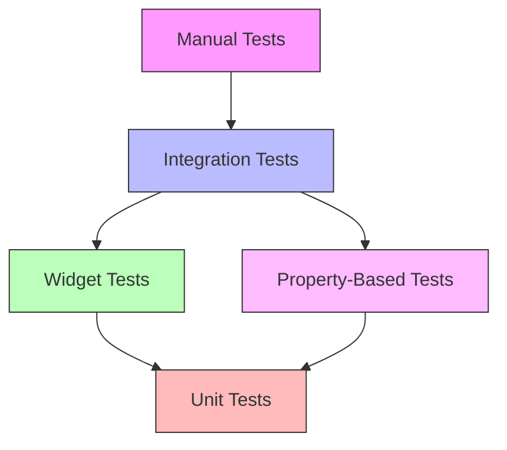

# Design Document: Retry Payment Testing

## Overview

This design document outlines the comprehensive testing strategy for the retry payment feature in the Order Lookup Screen. The feature integrates the Razorpay SDK to enable users to retry payments for unpaid orders, with automatic verification after successful payment completion.

### Testing Objectives

The testing strategy covers:
- **Widget Tests**: Verify UI rendering, button visibility, and user interactions based on order state
- **Integration Tests**: Validate end-to-end payment retry flows with mocked backend and SDK
- **Property-Based Tests**: Ensure correctness properties hold across all valid inputs
- **Manual Testing Procedures**: Document real-world testing scenarios with actual payment methods
- **Edge Case Testing**: Handle network failures, error states, and lifecycle events

### Key Components Under Test

1. **OrderLookupScreen**: Main widget containing retry payment functionality
2. **Razorpay SDK Integration**: Payment gateway initialization, event handlers, and disposal
3. **PaymentSession**: Shared state management for payment data
4. **PaymentApi**: Backend API integration for order fetching and verification
5. **OrderDetail Model**: Data model with needsAction business logic

### Testing Approach

The testing strategy follows a layered approach:
- **Unit/Widget Tests**: Fast, isolated tests for individual components and UI states
- **Integration Tests**: Slower tests validating complete user flows with mocked dependencies
- **Property-Based Tests**: Randomized tests ensuring correctness properties hold universally
- **Manual Tests**: Human-executed tests for real payment processing and device interactions

## Architecture

### Test File Organization

```
test/
├── screens/
│   ├── order_lookup_screen_test.dart          # Widget tests for UI rendering
│   └── order_lookup_screen_integration_test.dart  # Integration tests for flows
├── models/
│   └── order_detail_test.dart                 # Model tests (already exists)
├── mocks/
│   ├── mock_razorpay.dart                     # Mock Razorpay SDK
│   ├── mock_payment_api.dart                  # Mock PaymentApi
│   └── test_data.dart                         # Test fixtures and generators
└── manual/
    └── retry_payment_manual_test.md           # Manual testing procedures
```

### Testing Layers



### Mock Strategy

#### Razorpay SDK Mocking

The Razorpay SDK will be mocked using a wrapper interface pattern:

1. **RazorpayInterface**: Abstract interface defining SDK methods
2. **RazorpayWrapper**: Production wrapper around real Razorpay SDK
3. **MockRazorpay**: Test implementation with controllable behavior

This allows:
- Simulating payment success, failure, and wallet events
- Verifying SDK method calls and parameters
- Testing without real payment processing
- Controlling timing and async behavior

#### Backend API Mocking

The PaymentApi will be mocked using mockito:

1. **MockPaymentApi**: Generated mock from mockito
2. **Test Fixtures**: Predefined OrderDetail objects for various states
3. **Error Simulation**: Network timeouts, connection failures, API errors

### Test Data Strategy

#### Fixed Test Data

Predefined OrderDetail objects for common scenarios:
- Unpaid order (status: 'created')
- Failed order (status: 'failed')
- Authorized order (status: 'authorized')
- Paid order (status: 'paid')
- Captured order (status: 'captured')
- Verified order (status: 'verified')

#### Generated Test Data

For property-based tests, generators will create:
- Random order IDs (alphanumeric strings)
- Random amounts (positive integers in paise)
- Random status values from valid set
- Random payment IDs and signatures
- Random timestamps

## Components and Interfaces

### RazorpayInterface

```dart
abstract class RazorpayInterface {
  void on(String event, Function handler);
  void open(Map<String, dynamic> options);
  void clear();
}
```

### MockRazorpay

```dart
class MockRazorpay implements RazorpayInterface {
  final List<Map<String, dynamic>> openCalls = [];
  Function? successHandler;
  Function? errorHandler;
  Function? walletHandler;
  
  @override
  void on(String event, Function handler) {
    if (event == Razorpay.EVENT_PAYMENT_SUCCESS) successHandler = handler;
    if (event == Razorpay.EVENT_PAYMENT_ERROR) errorHandler = handler;
    if (event == Razorpay.EVENT_EXTERNAL_WALLET) walletHandler = handler;
  }
  
  @override
  void open(Map<String, dynamic> options) {
    openCalls.add(options);
  }
  
  @override
  void clear() {
    openCalls.clear();
    successHandler = null;
    errorHandler = null;
    walletHandler = null;
  }
  
  // Test helpers
  void simulateSuccess(String orderId, String paymentId, String signature) {
    successHandler?.call(PaymentSuccessResponse(orderId, paymentId, signature));
  }
  
  void simulateError(String message) {
    errorHandler?.call(PaymentFailureResponse(1, message, null));
  }
  
  void simulateWallet(String walletName) {
    walletHandler?.call(ExternalWalletResponse(walletName));
  }
}
```

### Test Data Generators

```dart
class TestData {
  static OrderDetail createOrder({
    String? orderId,
    int? amount,
    String? status,
    String? paymentId,
    String? signature,
  }) {
    return OrderDetail(
      orderId: orderId ?? 'order_${DateTime.now().millisecondsSinceEpoch}',
      amount: amount ?? 50000,
      status: status ?? 'created',
      paymentId: paymentId,
      signature: signature,
      createdAt: DateTime.now().millisecondsSinceEpoch ~/ 1000,
    );
  }
  
  // Property-based test generators
  static OrderDetail randomOrder() { /* ... */ }
  static OrderDetail randomUnpaidOrder() { /* ... */ }
  static OrderDetail randomPaidOrder() { /* ... */ }
}
```

## Data Models

### OrderDetail

Already implemented in `lib/models/order_detail.dart`. Key properties for testing:

- `needsAction`: Returns true when status is not 'paid', 'captured', or 'verified'
- `formattedAmount`: Returns amount in rupees with ₹ symbol and 2 decimal places
- `formattedCreatedAt`: Returns human-readable timestamp

### PaymentSession

Already implemented in `lib/models/payment_session.dart`. Key properties for testing:

- `orderId`, `paymentId`, `signature`: Payment data fields
- `hasSession`: Returns true when all three fields are non-null
- `clear()`: Resets all fields to null

### Test Fixtures

```dart
class OrderFixtures {
  static final unpaidCreated = OrderDetail(
    orderId: 'order_test_created',
    amount: 50000,
    status: 'created',
    createdAt: 1700000000,
  );
  
  static final unpaidFailed = OrderDetail(
    orderId: 'order_test_failed',
    amount: 100000,
    status: 'failed',
    createdAt: 1700000000,
  );
  
  static final paidOrder = OrderDetail(
    orderId: 'order_test_paid',
    amount: 75000,
    status: 'paid',
    paymentId: 'pay_test123',
    signature: 'sig_test123',
    createdAt: 1700000000,
  );
  
  // Additional fixtures for all status values
}
```


## Correctness Properties

*A property is a characteristic or behavior that should hold true across all valid executions of a system—essentially, a formal statement about what the system should do. Properties serve as the bridge between human-readable specifications and machine-verifiable correctness guarantees.*

### Property Reflection

After analyzing all acceptance criteria, the following redundancies were identified and consolidated:

**Consolidated Properties:**
- Requirements 1.1, 1.2, 1.7 (button visible for unpaid statuses) → Combined into Property 1
- Requirements 1.3, 1.4, 1.5 (button hidden for paid statuses) → Combined into Property 2
- Requirements 3.2, 3.3, 19.6, 19.7 (order data passed to SDK) → Combined into Property 4
- Requirements 3.4, 3.5, 19.1-19.5 (Razorpay configuration) → Combined into Property 5
- Requirements 4.1, 4.2, 4.3, 18.1, 18.2, 18.3 (payment data round-trip) → Combined into Property 6
- Requirements 14.1, 14.2 (action buttons visible when needsAction) → Combined into Property 13
- Requirements 14.3, 14.4 (action buttons hidden when not needsAction) → Combined into Property 14
- Requirements 15.1, 15.2 (error UI rendering) → Combined into Property 16
- Requirements 15.3, 15.4 (error clearing on new operations) → Combined into Property 17
- Requirements 17.1, 17.2, 17.3, 17.5 (loading indicators) → Combined into Property 20

**Eliminated Redundancies:**
- Requirement 13.3 is subsumed by Property 4 (amount passing without conversion)
- Requirement 5.3 is subsumed by Property 16 (error message visibility)

### Property 1: Retry Payment Button Visibility for Unpaid Orders

*For any* order with status in ['created', 'failed', 'authorized'], the Retry Payment button should be visible in the UI when the order is loaded.

**Validates: Requirements 1.1, 1.2, 1.7**

### Property 2: Retry Payment Button Hidden for Paid Orders

*For any* order with status in ['paid', 'captured', 'verified'], the Retry Payment button should not be visible in the UI when the order is loaded.

**Validates: Requirements 1.3, 1.4, 1.5**

### Property 3: Razorpay SDK Invocation on Button Tap

*For any* order with needsAction true, when the Retry Payment button is tapped, the Razorpay SDK open method should be called exactly once.

**Validates: Requirements 3.1**

### Property 4: Order Data Passed to Razorpay SDK

*For any* order, when the Retry Payment button is tapped, the Razorpay SDK should receive the exact order ID and amount (in paise) from the OrderDetail without any conversion.

**Validates: Requirements 3.2, 3.3, 13.3, 19.6, 19.7**

### Property 5: Razorpay Configuration Completeness

*For any* order, when the Retry Payment button is tapped, the Razorpay SDK options should include all required fields: key 'rzp_test_SHXH1wQoOlA037', currency 'INR', name 'Nourisha Pay', description 'Payment for order', and prefill contact and email.

**Validates: Requirements 3.4, 3.5, 19.1, 19.2, 19.3, 19.4, 19.5**

### Property 6: Payment Data Round-Trip Integrity

*For any* successful payment response from Razorpay SDK, the order ID, payment ID, and signature saved to PaymentSession should exactly match the values from the response.

**Validates: Requirements 4.1, 4.2, 4.3, 18.1, 18.2, 18.3**

### Property 7: Auto-Verification Trigger on Payment Success

*For any* successful payment response from Razorpay SDK, the auto-verification process should be triggered immediately.

**Validates: Requirements 4.4**

### Property 8: Success Message Display After Verification

*For any* successful verification completion, a success message should be displayed to the user.

**Validates: Requirements 4.5**

### Property 9: Error Message Display on Payment Failure

*For any* payment error response from Razorpay SDK, an error message should be displayed in the UI.

**Validates: Requirements 5.1**

### Property 10: Snackbar Display on External Wallet Selection

*For any* external wallet response from Razorpay SDK, a snackbar should be displayed containing the wallet name.

**Validates: Requirements 6.1**

### Property 11: Network Error Handling

*For any* network error (timeout or no connection) during order fetch or verification, an appropriate error message should be displayed to the user.

**Validates: Requirements 9.3**

### Property 12: State Clearing Behavior

*For any* UI state with error or result messages, calling clearLocalData should clear those messages while preserving the order details.

**Validates: Requirements 10.1, 10.2, 10.3**

### Property 13: Action Buttons Visible When Action Needed

*For any* order with needsAction true, the Verify Payment and Check Payment Status buttons should be visible in the UI.

**Validates: Requirements 14.1, 14.2**

### Property 14: Action Buttons Hidden When No Action Needed

*For any* order with needsAction false, the Verify Payment and Check Payment Status buttons should not be visible in the UI.

**Validates: Requirements 14.3, 14.4**

### Property 15: needsAction Correctness

*For any* order, needsAction should return true if and only if the status is not in ['paid', 'captured', 'verified'].

**Validates: Requirements 11.1, 11.2**

### Property 16: Error UI Rendering

*For any* error message, the UI should display it in a red error card with an error icon.

**Validates: Requirements 15.1, 15.2**

### Property 17: Error Clearing on New Operations

*For any* new operation (fetch, verify, or check status), previous error messages should be cleared before the operation starts.

**Validates: Requirements 15.3, 15.4**

### Property 18: Error Message Prefix Removal

*For any* error message containing the 'Exception: ' prefix, the displayed message should have the prefix removed.

**Validates: Requirements 15.5**

### Property 19: Amount Display Formatting

*For any* order, the displayed amount should show rupees with the ₹ symbol and exactly 2 decimal places.

**Validates: Requirements 13.4**

### Property 20: Loading Indicator Lifecycle

*For any* async operation (fetch, verify, or check status), the corresponding button should show a loading indicator during the operation and remove it upon completion.

**Validates: Requirements 17.1, 17.2, 17.3, 17.5**

### Property 21: Order Serialization Round-Trip

*For any* order fetched from the backend API, serializing and deserializing the OrderDetail object should preserve all data without loss.

**Validates: Requirements 18.4**


## Error Handling

### Error Categories

#### 1. Network Errors

**Timeout Errors**
- Scenario: HTTP request exceeds 15-second timeout
- Handling: Display "Request timed out. Please try again."
- Testing: Mock TimeoutException in PaymentApi calls

**Connection Errors**
- Scenario: No internet connectivity
- Handling: Display "No internet connection."
- Testing: Mock SocketException in PaymentApi calls

#### 2. Payment Errors

**Payment Cancellation**
- Scenario: User cancels payment in Razorpay SDK
- Handling: Display "Payment failed: Payment cancelled by user"
- Testing: Simulate PaymentFailureResponse with cancellation message

**Payment Processing Errors**
- Scenario: Payment fails due to insufficient funds, card decline, etc.
- Handling: Display "Payment failed: [error message from SDK]"
- Testing: Simulate PaymentFailureResponse with various error messages

#### 3. Verification Errors

**Missing Payment Data**
- Scenario: Attempting verification without payment ID or signature
- Handling: Display "Payment ID or signature not available for verification"
- Testing: Call _verifyPayment with incomplete order data

**Backend Verification Failure**
- Scenario: Backend rejects verification due to signature mismatch
- Handling: Display error message from backend
- Testing: Mock PaymentApi.verifyPayment to throw exception

#### 4. Order Fetch Errors

**Invalid Order ID**
- Scenario: Order ID doesn't exist in database
- Handling: Display error message from backend
- Testing: Mock PaymentApi.getOrder to throw exception

**Validation Errors**
- Scenario: Empty order ID submitted
- Handling: Form validation prevents submission, shows "Please enter an order ID"
- Testing: Submit form with empty input

### Error Display Strategy

All errors follow a consistent display pattern:

1. **Error Card**: Red background with red border
2. **Error Icon**: Material Icons error_outline icon
3. **Error Text**: Red text with error message
4. **Prefix Removal**: Strip "Exception: " prefix from error messages
5. **Persistence**: Errors remain visible until cleared by new operation or clearLocalData

### Error Recovery

- **Retry Capability**: All failed operations can be retried by user
- **State Preservation**: Order details remain visible after errors
- **Clear Feedback**: Error messages clearly indicate what went wrong
- **Manual Fallback**: Users can manually verify or check status if auto-verification fails

## Testing Strategy

### Dual Testing Approach

The testing strategy employs both unit/widget tests and property-based tests:

**Unit/Widget Tests**
- Verify specific examples and edge cases
- Test integration points between components
- Validate error conditions and UI states
- Fast execution for rapid feedback

**Property-Based Tests**
- Verify universal properties across all inputs
- Use randomized test data for comprehensive coverage
- Minimum 100 iterations per property test
- Catch edge cases not anticipated in unit tests

Both approaches are complementary and necessary for comprehensive coverage. Unit tests provide concrete examples and catch specific bugs, while property tests ensure correctness holds universally.

### Test Configuration

#### Property-Based Testing Library

**Library**: Use `test` package with custom generators (Flutter doesn't have a mature PBT library like QuickCheck or Hypothesis)

**Alternative**: Consider `faker` package for generating random test data

**Configuration**:
```dart
// Run each property test 100 times with different random inputs
for (var i = 0; i < 100; i++) {
  final order = TestData.randomOrder();
  // Test property with random order
}
```

#### Test Tagging

Each property-based test must include a comment tag referencing the design property:

```dart
// Feature: retry-payment-testing, Property 1: Retry Payment Button Visibility for Unpaid Orders
test('property: retry button visible for unpaid orders', () {
  for (var i = 0; i < 100; i++) {
    final order = TestData.randomUnpaidOrder();
    // Test implementation
  }
});
```

### Widget Test Patterns

#### Pattern 1: UI State Testing

```dart
testWidgets('retry button visible when order status is created', (tester) async {
  final order = TestData.createOrder(status: 'created');
  final session = PaymentSession();
  
  await tester.pumpWidget(MaterialApp(
    home: OrderLookupScreen(session: session),
  ));
  
  // Simulate order loaded
  final state = tester.state<_OrderLookupScreenState>(
    find.byType(OrderLookupScreen),
  );
  state._orderDetail = order;
  await tester.pump();
  
  expect(find.text('Retry Payment'), findsOneWidget);
});
```

#### Pattern 2: Button Interaction Testing

```dart
testWidgets('tapping retry button calls Razorpay SDK', (tester) async {
  final mockRazorpay = MockRazorpay();
  final order = TestData.createOrder(status: 'created');
  
  // Inject mock Razorpay
  await tester.pumpWidget(MaterialApp(
    home: OrderLookupScreen(
      session: PaymentSession(),
      razorpay: mockRazorpay, // Requires refactoring to inject
    ),
  ));
  
  // Load order and tap button
  // ...
  
  expect(mockRazorpay.openCalls.length, 1);
  expect(mockRazorpay.openCalls[0]['order_id'], order.orderId);
});
```

#### Pattern 3: Event Handler Testing

```dart
testWidgets('payment success saves data to session', (tester) async {
  final mockRazorpay = MockRazorpay();
  final session = PaymentSession();
  
  await tester.pumpWidget(MaterialApp(
    home: OrderLookupScreen(
      session: session,
      razorpay: mockRazorpay,
    ),
  ));
  
  // Simulate payment success
  mockRazorpay.simulateSuccess('order_123', 'pay_456', 'sig_789');
  await tester.pump();
  
  expect(session.orderId, 'order_123');
  expect(session.paymentId, 'pay_456');
  expect(session.signature, 'sig_789');
});
```

### Integration Test Scenarios

#### Scenario 1: Complete Retry Payment Flow

```dart
testWidgets('complete retry payment flow', (tester) async {
  final mockApi = MockPaymentApi();
  final mockRazorpay = MockRazorpay();
  final session = PaymentSession();
  
  // Setup mocks
  when(mockApi.getOrder('order_123')).thenAnswer((_) async => 
    TestData.createOrder(orderId: 'order_123', status: 'created')
  );
  when(mockApi.verifyPayment(any, any, any)).thenAnswer((_) async => 
    {'status': 'success', 'verified': true}
  );
  
  // 1. Enter order ID and fetch
  await tester.enterText(find.byType(TextFormField), 'order_123');
  await tester.tap(find.text('Fetch Order'));
  await tester.pumpAndSettle();
  
  // 2. Verify order details displayed
  expect(find.text('order_123'), findsOneWidget);
  expect(find.text('Retry Payment'), findsOneWidget);
  
  // 3. Tap retry payment button
  await tester.tap(find.text('Retry Payment'));
  await tester.pump();
  
  // 4. Verify Razorpay SDK called
  expect(mockRazorpay.openCalls.length, 1);
  
  // 5. Simulate payment success
  mockRazorpay.simulateSuccess('order_123', 'pay_456', 'sig_789');
  await tester.pumpAndSettle();
  
  // 6. Verify auto-verification triggered
  verify(mockApi.verifyPayment('order_123', 'pay_456', 'sig_789')).called(1);
  
  // 7. Verify success message displayed
  expect(find.text('Payment verified successfully'), findsOneWidget);
});
```

#### Scenario 2: Payment Cancellation Flow

```dart
testWidgets('payment cancellation shows error', (tester) async {
  // Setup and load order
  // ...
  
  // Tap retry payment
  await tester.tap(find.text('Retry Payment'));
  await tester.pump();
  
  // Simulate payment cancellation
  mockRazorpay.simulateError('Payment cancelled by user');
  await tester.pump();
  
  // Verify error message displayed
  expect(find.text('Payment failed: Payment cancelled by user'), findsOneWidget);
  expect(find.byIcon(Icons.error_outline), findsOneWidget);
});
```

#### Scenario 3: Network Error During Fetch

```dart
testWidgets('network timeout shows error message', (tester) async {
  final mockApi = MockPaymentApi();
  
  when(mockApi.getOrder(any)).thenThrow(
    Exception('Request timed out. Please try again.')
  );
  
  // Enter order ID and fetch
  await tester.enterText(find.byType(TextFormField), 'order_123');
  await tester.tap(find.text('Fetch Order'));
  await tester.pumpAndSettle();
  
  // Verify error message
  expect(find.text('Request timed out. Please try again.'), findsOneWidget);
});
```

### Property-Based Test Implementation

#### Property Test 1: Button Visibility for Unpaid Orders

```dart
// Feature: retry-payment-testing, Property 1: Retry Payment Button Visibility for Unpaid Orders
test('property: retry button visible for unpaid orders', () async {
  final unpaidStatuses = ['created', 'failed', 'authorized'];
  
  for (var i = 0; i < 100; i++) {
    final status = unpaidStatuses[Random().nextInt(unpaidStatuses.length)];
    final order = TestData.randomOrder(status: status);
    
    await tester.pumpWidget(MaterialApp(
      home: OrderLookupScreen(session: PaymentSession()),
    ));
    
    // Load order
    final state = tester.state<_OrderLookupScreenState>(
      find.byType(OrderLookupScreen),
    );
    state._orderDetail = order;
    await tester.pump();
    
    // Verify button visible
    expect(
      find.text('Retry Payment'),
      findsOneWidget,
      reason: 'Retry button should be visible for status: $status',
    );
  }
});
```

#### Property Test 2: Order Data Integrity

```dart
// Feature: retry-payment-testing, Property 4: Order Data Passed to Razorpay SDK
test('property: order data passed to SDK without conversion', () async {
  for (var i = 0; i < 100; i++) {
    final order = TestData.randomUnpaidOrder();
    final mockRazorpay = MockRazorpay();
    
    // Setup and tap retry button
    // ...
    
    final options = mockRazorpay.openCalls.last;
    expect(options['order_id'], order.orderId);
    expect(options['amount'], order.amount); // No conversion
  }
});
```

#### Property Test 3: Payment Data Round-Trip

```dart
// Feature: retry-payment-testing, Property 6: Payment Data Round-Trip Integrity
test('property: payment data round-trip integrity', () async {
  for (var i = 0; i < 100; i++) {
    final orderId = 'order_${Random().nextInt(100000)}';
    final paymentId = 'pay_${Random().nextInt(100000)}';
    final signature = 'sig_${Random().nextInt(100000)}';
    
    final mockRazorpay = MockRazorpay();
    final session = PaymentSession();
    
    // Setup widget with mock
    // ...
    
    // Simulate payment success
    mockRazorpay.simulateSuccess(orderId, paymentId, signature);
    await tester.pump();
    
    // Verify round-trip integrity
    expect(session.orderId, orderId);
    expect(session.paymentId, paymentId);
    expect(session.signature, signature);
  }
});
```

### Manual Testing Procedures

Manual testing procedures are documented in a separate file: `test/manual/retry_payment_manual_test.md`

The manual test document includes:

1. **Test Environment Setup**
   - Razorpay test mode configuration
   - Test payment credentials
   - Device setup requirements

2. **Test Scenarios**
   - Creating unpaid orders
   - Retry payment with different payment methods (card, UPI, wallet)
   - Payment cancellation
   - Payment failure scenarios
   - Auto-verification after success
   - Order status updates

3. **Payment Method Testing**
   - Test credit card: 4111 1111 1111 1111
   - Test UPI ID: success@razorpay
   - Test debit card variations
   - External wallet selection (Paytm, PhonePe, etc.)

4. **App Lifecycle Testing**
   - Minimize app during payment
   - Device rotation during payment
   - Incoming phone call during payment
   - App backgrounding and state preservation

5. **Expected Results**
   - Success criteria for each scenario
   - Error messages to verify
   - UI state expectations

### Test Coverage Metrics

#### Target Coverage

- **Line Coverage**: Minimum 90% for OrderLookupScreen
- **Branch Coverage**: Minimum 85% for conditional logic
- **Widget Coverage**: 100% of UI states tested
- **Property Coverage**: All 21 correctness properties implemented

#### Coverage Exclusions

- Razorpay SDK internal implementation (third-party)
- Platform-specific code (Android/iOS)
- Generated code (mocks, JSON serialization)

#### Coverage Reporting

```bash
# Run tests with coverage
flutter test --coverage

# Generate HTML report
genhtml coverage/lcov.info -o coverage/html

# View report
open coverage/html/index.html
```

### Test Execution Strategy

#### Development Workflow

1. **Pre-commit**: Run fast widget tests
2. **Pre-push**: Run all tests including integration tests
3. **CI/CD**: Run full test suite with coverage reporting

#### Test Organization

```bash
# Run only widget tests
flutter test test/screens/order_lookup_screen_test.dart

# Run only integration tests
flutter test test/screens/order_lookup_screen_integration_test.dart

# Run all tests
flutter test

# Run with coverage
flutter test --coverage
```

#### Performance Considerations

- Widget tests: ~50ms per test
- Integration tests: ~200ms per test
- Property-based tests: ~5-10 seconds per property (100 iterations)
- Total test suite: Target < 2 minutes

### Continuous Integration

#### CI Pipeline

```yaml
# .github/workflows/test.yml
name: Test
on: [push, pull_request]
jobs:
  test:
    runs-on: ubuntu-latest
    steps:
      - uses: actions/checkout@v2
      - uses: subosito/flutter-action@v2
      - run: flutter pub get
      - run: flutter analyze
      - run: flutter test --coverage
      - run: flutter test --coverage --reporter=json > test-results.json
```

#### Quality Gates

- All tests must pass
- Coverage must not decrease
- No new analyzer warnings
- Property tests must complete successfully

